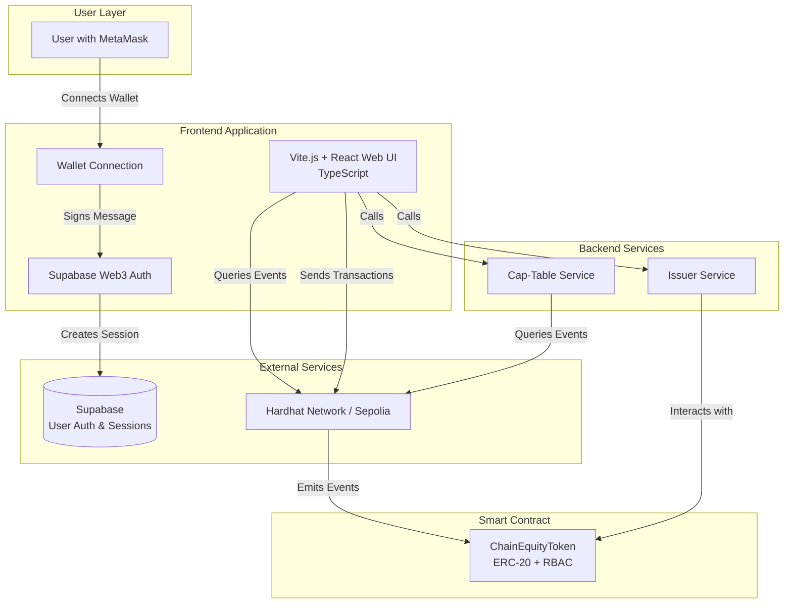
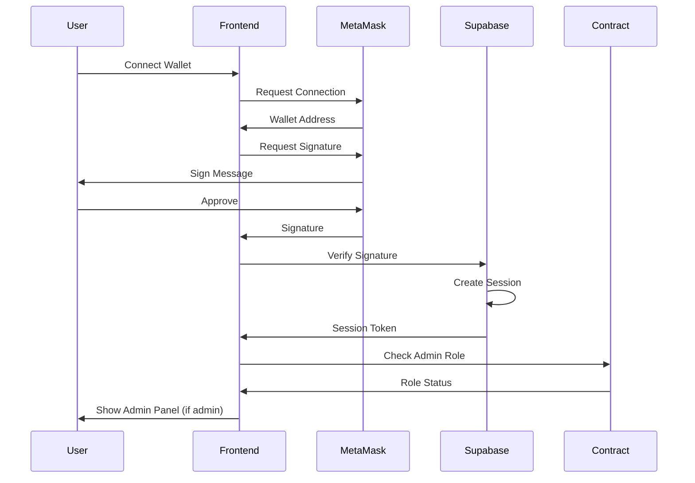
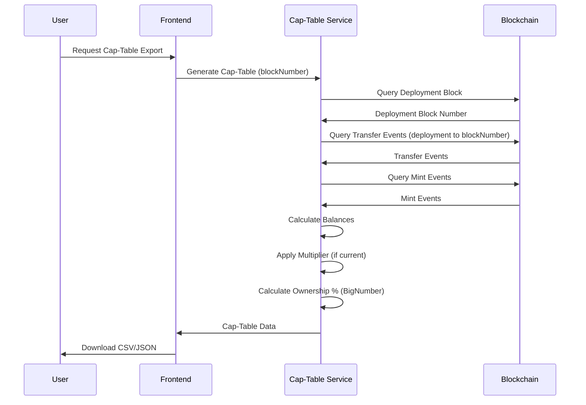
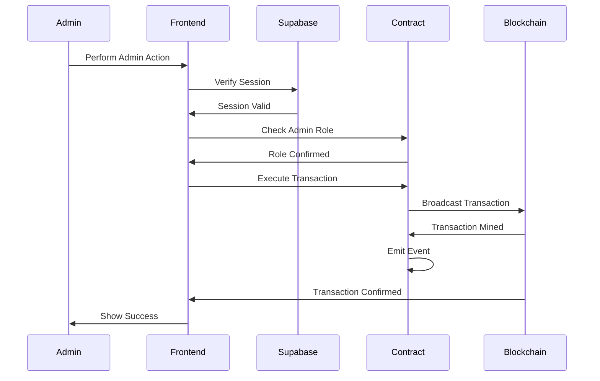
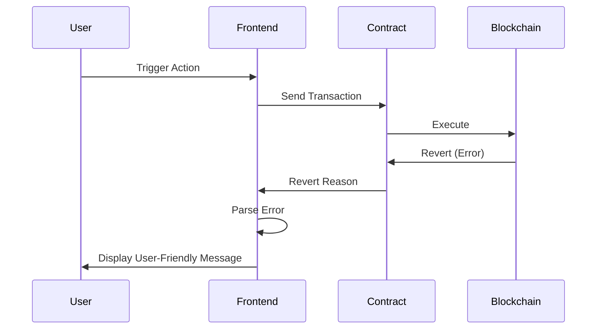

# ChainEquity Architecture Document

## Introduction

This document outlines the complete architecture for ChainEquity, a tokenized equity prototype with on-chain compliance gating. The system demonstrates on-chain equity management with transfer restrictions, corporate actions, and cap-table management.

This architecture combines smart contract development, Web3 authentication, and a modern web interface to create a production-quality demo within a 24-hour sprint timeline.

### Document Scope

This architecture covers:
- Smart contract design and implementation
- Web3 authentication and user session management
- Frontend application architecture
- Cap-table generation service
- Integration patterns between components
- **Rounding and precision considerations**

### Change Log

| Date | Version | Description | Author |
|------|---------|-------------|--------|
| 2024-12-XX | 1.0 | Initial architecture document | Architect |
| 2024-12-XX | 1.1 | Added rounding and precision considerations | Architect |

---

## Rounding and Precision Considerations

### Potential Rounding Issues

**1. Ownership Percentage Calculation:**
- **Issue:** JavaScript `number` type has ~15-17 significant digits precision
- **Risk:** When calculating `(balance / totalSupply) * 100`, precision can be lost for large numbers
- **Solution:** Use BigNumber division with fixed decimal precision, store as string

**2. Multiplier Storage:**
- **Issue:** Multiplier stored as `number` in TypeScript interface
- **Risk:** If multiplier becomes very large, JavaScript number precision loss
- **Solution:** Store multiplier as string (BigNumber) in TypeScript

**3. Percentage Sum Validation:**
- **Issue:** Individual percentages may not sum to exactly 100% due to rounding
- **Risk:** Users may notice percentages don't add up to 100%
- **Solution:** Document rounding behavior, use consistent precision, optionally show rounding note

### Solutions Implemented

**Smart Contract (No Issues):**
- All balances stored as `uint256` (no decimal places, no rounding)
- Multiplier stored as `uint256` (no rounding issues)
- All arithmetic uses integer math (no precision loss)

**Frontend/Backend (TypeScript):**
- Store all balances as strings (BigNumber serialization)
- Calculate percentages using BigNumber division with high precision
- Format percentages as strings with fixed 6 decimal places
- Never convert large BigNumbers to JavaScript `number` type

**Example Percentage Calculation:**
```typescript
// ❌ BAD: Precision loss with JavaScript numbers
const percentage = (balance / totalSupply) * 100; // JavaScript number - loses precision!

// ✅ GOOD: High precision with BigNumber
const balanceBN = ethers.BigNumber.from(balance);
const totalSupplyBN = ethers.BigNumber.from(totalSupply);
const PRECISION = ethers.BigNumber.from(10).pow(6); // 6 decimal places

const percentageScaled = balanceBN
  .mul(100)           // Convert to percentage
  .mul(PRECISION)     // Scale for precision
  .div(totalSupplyBN);

const percentageStr = ethers.utils.formatUnits(percentageScaled, 6); // "12.345678"
```

---

## High Level Architecture

### Technical Summary

ChainEquity is a blockchain-based tokenized equity system built on Ethereum-compatible networks (Hardhat local network for development, Sepolia testnet for public demo). The architecture follows a decentralized approach where the smart contract serves as the source of truth for token ownership, allowlist status, and corporate actions. The frontend application uses Supabase Web3 authentication for user session management, while all cap-table data is generated on-demand by querying blockchain events directly. This design eliminates the need for a separate event indexer while maintaining full historical query capabilities.

The system uses Vite.js + React (TypeScript) for the frontend, ethers.js (TypeScript) for blockchain interactions, and Supabase for Web3 authentication. The smart contract is built with Solidity 0.8.x and OpenZeppelin libraries, implementing ERC-20 standards with custom transfer restrictions and corporate action capabilities. All code is written in TypeScript wherever possible for type safety and better developer experience.

**Precision Handling:** The system uses BigNumber for all balance and percentage calculations to avoid JavaScript number precision loss. Ownership percentages are calculated with high precision and stored as strings with fixed decimal places.

### Platform and Infrastructure Choice

**Selected Platform:** Monorepo + Local Development + Supabase Cloud + Firebase Hosting

**Key Services:**
- **Blockchain:** Hardhat Network (local) / Sepolia Testnet (public demo)
- **Authentication:** Supabase Web3 Auth (cloud-hosted)
- **Frontend Hosting:** Firebase Hosting (global CDN)
- **RPC Provider:** Local Hardhat node / Infura/Alchemy (for Sepolia)

**Deployment Host and Regions:**
- Local development: Hardhat network on localhost:8545
- Supabase: Cloud-hosted (region TBD based on Supabase project location)
- Firebase Hosting: Global CDN for frontend deployment
- Monorepo structure: Single repository with npm workspaces

**Rationale:**
- Hardhat local network provides zero-cost, fast iteration during development
- Supabase Web3 Auth handles authentication complexity without requiring custom backend
- Direct blockchain queries eliminate database dependency for cap-table data
- Monorepo simplifies development and deployment
- Firebase Hosting provides simple, reliable hosting with global CDN
- Simple architecture suitable for 24-hour sprint timeline

### Repository Structure

**Structure:** Monorepo (single repository with npm workspaces)

**Monorepo Tool:** npm workspaces (simple, no additional tooling required)

**Package Organization:**
```
chain-equity/                           # Monorepo root
├── contracts/                         # Hardhat workspace
│   ├── src/
│   │   └── ChainEquityToken.sol       # Main token contract
│   ├── scripts/
│   │   ├── deploy.ts                  # Deployment script (TypeScript)
│   │   └── demo.ts                    # Demo flow script (TypeScript)
│   ├── test/
│   │   └── ChainEquityToken.test.ts   # Contract test suite (TypeScript)
│   └── hardhat.config.ts              # Hardhat configuration (TypeScript)
├── backend/                           # Backend workspace
│   ├── src/
│   │   ├── cap-table.ts               # Cap-table generation (TypeScript)
│   │   └── issuer.ts                  # Issuer service (TypeScript)
│   └── package.json
├── frontend/                          # Frontend workspace (Vite.js)
│   ├── src/
│   │   ├── pages/                     # React pages/components
│   │   ├── components/                # React components (TypeScript)
│   │   ├── lib/                       # Contract interaction utilities (TypeScript)
│   │   └── main.tsx                   # Vite entry point
│   ├── vite.config.ts                 # Vite configuration
│   ├── tsconfig.json                      # TypeScript configuration
│   ├── tailwind.config.js             # Tailwind CSS configuration
│   ├── postcss.config.js              # PostCSS configuration
│   └── package.json
├── package.json                        # Root package.json (workspace config)
├── firebase.json                       # Firebase Hosting configuration
└── README.md
```

**Rationale:**
- **Monorepo:** Single repository simplifies development, deployment, and dependency management
- **npm workspaces:** Sufficient for this project size, no additional tooling required
- **TypeScript throughout:** Type safety across frontend, backend, and contract scripts
- **Clear separation:** Each workspace has distinct purpose while sharing dependencies
- **Vite.js:** Fast development server and optimized production builds
- **Firebase Hosting:** Simple, reliable hosting with global CDN

### High Level Architecture Diagram



### Architectural Patterns

- **Smart Contract as Source of Truth:** All token state, allowlist, and ownership data stored on-chain
- **Event-Driven Cap-Table Generation:** Cap-table calculated by processing Transfer/Mint/Burn events on-demand
- **Web3 Authentication Pattern:** Wallet-based authentication with Supabase session management
- **Component-Based Frontend:** React components with Vite.js for fast development
- **Direct Blockchain Queries:** No intermediate database layer for cap-table data
- **Role-Based Access Control (RBAC):** On-chain role management using OpenZeppelin AccessControl
- **Monorepo Pattern:** Single repository with npm workspaces for code organization

---

## Tech Stack

### Technology Stack Table

| Category | Technology | Version | Purpose | Rationale |
|----------|-----------|---------|---------|-----------|
| Smart Contract Language | Solidity | 0.8.x | Contract development | Industry standard, OpenZeppelin compatibility |
| Smart Contract Framework | Hardhat | ^2.x | Development, testing, deployment | Best-in-class tooling, excellent testing support |
| Contract Libraries | OpenZeppelin | ^5.0.0 | ERC-20, AccessControl | Battle-tested, secure, standard implementations |
| Blockchain Interaction | ethers.js | ^6.x | Frontend and backend blockchain queries | Modern API, excellent TypeScript support |
| Frontend Framework | Vite.js + React | ^5.x + ^18.x | Web application | Fast development server, optimized builds, excellent DX |
| TypeScript | TypeScript | ^5.x | Type safety | Type safety across frontend, backend, and scripts |
| Styling | Tailwind CSS | ^3.x (latest) | UI styling | Utility-first CSS framework, modern responsive design |
| Authentication | Supabase Web3 Auth | ^2.x | User authentication and sessions | Handles Web3 auth complexity, persistent sessions |
| State Management | React Hooks | Built-in | Frontend state | Sufficient for this application scope |
| Wallet Connection | wagmi | ^2.x | MetaMask integration | Best-in-class Web3 React hooks |
| Build Tool | Vite | ^5.x | Frontend bundling | Fast builds with esbuild, optimized for production |
| Testing | Hardhat Test | ^2.x | Contract testing | Integrated with Hardhat |
| Package Manager | npm | Latest | Dependency management | Standard, no additional setup |

---

## Data Models

### Token Ownership Model

**Purpose:** Represents token ownership and balance information for cap-table generation.

**Key Attributes:**
- `walletAddress`: `address` - Ethereum wallet address of token holder
- `balance`: `uint256` - Current token balance (with multiplier applied)
- `baseBalance`: `uint256` - Base balance before multiplier (internal contract state)
- `ownershipPercentage`: `string` - Percentage of total supply owned (as string to preserve precision)
- `isAllowlisted`: `boolean` - Whether wallet is on the allowlist

**TypeScript Interface:**
```typescript
interface TokenHolder {
  walletAddress: string;
  balance: string; // BigNumber as string (no precision loss)
  baseBalance: string; // BigNumber as string (no precision loss)
  ownershipPercentage: string; // Percentage as string with decimals (e.g., "12.345678") to avoid rounding
  isAllowlisted: boolean;
}

interface CapTable {
  holders: TokenHolder[];
  totalSupply: string;
  blockNumber: number;
  timestamp: number;
}
```

**Relationships:**
- One-to-many: One contract can have many token holders
- Derived from: Transfer, Mint, Burn events on the blockchain

### User Session Model

**Purpose:** Represents authenticated user sessions managed by Supabase.

**Key Attributes:**
- `id`: `uuid` - Supabase user ID
- `walletAddress`: `string` - Ethereum wallet address
- `sessionToken`: `string` - Supabase session token
- `createdAt`: `timestamp` - Session creation time
- `expiresAt`: `timestamp` - Session expiration time

**TypeScript Interface:**
```typescript
interface UserSession {
  id: string;
  walletAddress: string;
  sessionToken: string;
  createdAt: Date;
  expiresAt: Date;
}
```

**Relationships:**
- Managed by: Supabase Web3 Auth
- Linked to: On-chain wallet address for role verification

### Contract State Model

**Purpose:** Represents the current state of the smart contract.

**Key Attributes:**
- `contractAddress`: `address` - Deployed contract address
- `symbol`: `string` - Token symbol (mutable)
- `name`: `string` - Token name
- `totalSupply`: `string` - Total token supply (BigNumber as string)
- `multiplier`: `string` - Current split multiplier (BigNumber as string, could be large)
- `allowlistCount`: `number` - Number of allowlisted addresses

**TypeScript Interface:**
```typescript
interface ContractState {
  contractAddress: string;
  symbol: string;
  name: string;
  totalSupply: string; // BigNumber as string
  multiplier: string; // BigNumber as string (could be large)
  allowlistCount: number;
}
```

**Relationships:**
- Queried directly from: Smart contract view functions
- Updated by: Corporate actions (split, symbol change)

---

## Smart Contract Architecture

### Contract Structure

**Contract Name:** `ChainEquityToken`

**Inheritance Hierarchy:**
```
ERC20 (OpenZeppelin)
  └── AccessControl (OpenZeppelin)
      └── ChainEquityToken (Custom)
```

**Key Components:**

1. **ERC-20 Base Functionality**
   - Standard token transfers
   - Balance queries
   - Approval mechanism

2. **AccessControl Integration**
   - `DEFAULT_ADMIN_ROLE`: Full contract control
   - `MINTER_ROLE`: Can mint new tokens
   - `APPROVER_ROLE`: Can modify allowlist

3. **Allowlist Mechanism**
   - `mapping(address => bool) public allowlist`
   - Transfer override to check both sender and recipient
   - Admin functions to add/remove addresses

4. **Virtual Split Implementation**
   - `uint256 private _multiplier` (default: 1)
   - Base balances stored internally
   - View functions apply multiplier
   - Split operation updates multiplier only

5. **Mutable Symbol**
   - Custom `_symbol` variable (overrides OpenZeppelin)
   - `changeSymbol()` function for updates

### Contract Events

```solidity
event AllowlistUpdated(address indexed account, bool approved);
event SplitExecuted(uint256 newMultiplier, uint256 blockNumber);
event SymbolChanged(string oldSymbol, string newSymbol);
// Standard ERC-20 events: Transfer, Approval
```

### Contract Functions

**Public/External Functions:**
- `transfer(address to, uint256 amount)` - Overridden with allowlist check
- `transferFrom(address from, address to, uint256 amount)` - Overridden with allowlist check
- `balanceOf(address account)` - Returns balance with multiplier applied
- `totalSupply()` - Returns total supply with multiplier applied
- `symbol()` - Returns current symbol
- `allowlist(address account)` - View allowlist status

**Admin Functions (Role-Gated):**
- `mint(address to, uint256 amount)` - Mint tokens (MINTER_ROLE)
- `approveWallet(address account)` - Add to allowlist (APPROVER_ROLE)
- `revokeWallet(address account)` - Remove from allowlist (APPROVER_ROLE)
- `executeSplit(uint256 newMultiplier)` - Execute stock split (DEFAULT_ADMIN_ROLE)
- `changeSymbol(string memory newSymbol)` - Change token symbol (DEFAULT_ADMIN_ROLE)

---

## Frontend Architecture

### Component Architecture

**Component Organization:**
```
frontend/
├── src/
│   ├── pages/
│   │   ├── Home.tsx              # Home page (TypeScript)
│   │   ├── Admin.tsx             # Admin dashboard (TypeScript)
│   │   └── CapTable.tsx          # Cap-table viewer (TypeScript)
│   ├── components/
│   │   ├── WalletConnection.tsx  # MetaMask connection (TypeScript)
│   │   ├── AdminPanel.tsx        # Admin operations (TypeScript)
│   │   ├── CapTableViewer.tsx    # Cap-table display (TypeScript)
│   │   └── TransactionStatus.tsx # Transaction feedback (TypeScript)
│   ├── lib/
│   │   ├── supabase.ts           # Supabase client (TypeScript)
│   │   ├── contract.ts           # Contract interaction utilities (TypeScript)
│   │   ├── capTable.ts          # Cap-table generation (TypeScript)
│   │   └── auth.ts               # Authentication helpers (TypeScript)
│   ├── hooks/
│   │   ├── useAuth.ts            # Authentication hook (TypeScript)
│   │   ├── useContract.ts        # Contract interaction hook (TypeScript)
│   │   └── useCapTable.ts        # Cap-table query hook (TypeScript)
│   ├── types/
│   │   └── index.ts              # TypeScript type definitions
│   ├── styles/
│   │   └── index.css             # Tailwind CSS imports
│   └── main.tsx                  # Vite entry point
├── vite.config.ts                # Vite configuration
├── tsconfig.json                  # TypeScript configuration
├── tailwind.config.js             # Tailwind CSS configuration
├── postcss.config.js              # PostCSS configuration
└── package.json
```

**Component Template:**
```typescript
import { useAuth } from '@/hooks/useAuth';
import { useContract } from '@/hooks/useContract';

export default function AdminPanel() {
  const { user, session } = useAuth();
  const { contract, isAdmin } = useContract();
  
  // Component logic
}
```

### State Management Architecture

**State Structure:**
- **Authentication State:** Managed by Supabase client (session, user)
- **Wallet State:** Managed by wagmi hooks (connection, account, chain)
- **Contract State:** Managed by custom hooks (contract instance, roles)
- **UI State:** React useState for local component state

**State Management Patterns:**
- Supabase session state via `@supabase/supabase-js` client
- wagmi hooks for wallet connection state
- Custom React hooks for contract interactions
- Context API for global app state (if needed)

### Routing Architecture

**Route Organization:**
```
/                    # Home - wallet connection (React Router)
/admin               # Admin dashboard (protected route)
/cap-table           # Cap-table viewer
```

**Note:** Using React Router for client-side routing in Vite.js application (TypeScript).

**Protected Route Pattern:**
```typescript
import { useAuth } from '@/hooks/useAuth';
import { Navigate } from 'react-router-dom';

export default function ProtectedPage() {
  const { session, loading } = useAuth();
  
  if (loading) return <Loading />;
  if (!session) {
    return <Navigate to="/" replace />;
  }
  
  return <PageContent />;
}
```

### Frontend Services Layer

**API Client Setup:**
```typescript
// lib/supabase.ts
import { createClient } from '@supabase/supabase-js';

export const supabase = createClient(
  process.env.VITE_SUPABASE_URL!,
  process.env.VITE_SUPABASE_ANON_KEY!
);
```

**Service Example:**
```typescript
// lib/contract.ts
import { ethers } from 'ethers';
import { ChainEquityTokenABI } from '@/abis/ChainEquityToken';

export async function getContractInstance(
  provider: ethers.Provider,
  contractAddress: string
) {
  return new ethers.Contract(
    contractAddress,
    ChainEquityTokenABI,
    provider
  );
}
```

---

## Backend Architecture

### Service Architecture

**Service Organization:**
```
backend/
├── src/
│   ├── cap-table.ts          # Cap-table generation service (TypeScript)
│   ├── issuer.ts             # Issuer service (admin operations) (TypeScript)
│   └── utils/
│       ├── provider.ts       # Blockchain provider setup (TypeScript)
│       └── events.ts         # Event query utilities (TypeScript)
├── tsconfig.json             # TypeScript configuration
└── package.json
```

**Service Template:**
```typescript
// backend/src/cap-table.ts
import { ethers } from 'ethers';
import { getProvider } from './utils/provider';
import type { CapTable, TokenHolder } from './types';

export async function generateCapTable(
  contractAddress: string,
  blockNumber: number | null = null
): Promise<CapTable> {
  const provider = getProvider();
  const contract = new ethers.Contract(contractAddress, ABI, provider);
  
  // Query events from deployment block to target block
  const events = await queryTransferEvents(contract, blockNumber);
  
  // Calculate balances
  const balances = calculateBalances(events);
  
  return formatCapTable(balances);
}
```

### Cap-Table Service Architecture

**Cap-Table Generation Flow:**

1. **Query Deployment Block:**
   - Get contract deployment transaction
   - Extract deployment block number

2. **Query Events:**
   - Query `Transfer` events from deployment block to target block
   - Query `Mint` events
   - Query `Burn` events (if implemented)

3. **Calculate Balances:**
   - Process events chronologically
   - Track balance changes per address
   - Apply multiplier if querying current state

4. **Calculate Ownership Percentages:**
   - Formula: `(balance * 100 * precision) / totalSupply` where precision = 1e6 for 6 decimal places
   - This gives: `(balance * 100 * 1e6) / totalSupply` = percentage scaled by 1e6
   - Format as decimal string with 6 decimal places using `formatUnits(value, 6)`
   - Sum all percentages and note rounding discrepancy if not exactly 100%

5. **Format Output:**
   - Format as CSV or JSON
   - Include metadata (block number, timestamp)
   - Include rounding note if percentages don't sum to exactly 100%

**Event Query Implementation:**
```typescript
async function queryTransferEvents(
  contract: ethers.Contract,
  toBlock: number | null = null
): Promise<ethers.EventLog[]> {
  const filter = contract.filters.Transfer();
  const events = await contract.queryFilter(filter, deploymentBlock, toBlock);
  return events;
}
```

**Ownership Percentage Calculation (Avoiding Rounding Issues):**
```typescript
import { ethers } from 'ethers';

function calculateOwnershipPercentage(
  balance: ethers.BigNumberish,
  totalSupply: ethers.BigNumberish
): string {
  const balanceBN = ethers.BigNumber.from(balance);
  const totalSupplyBN = ethers.BigNumber.from(totalSupply);
  
  // Formula: (balance / totalSupply) * 100
  // To avoid precision loss, we scale up before division:
  // (balance * 100 * 1e6) / totalSupply = percentage * 1e6
  const PRECISION = ethers.BigNumber.from(10).pow(6); // 6 decimal places
  const percentageScaled = balanceBN
    .mul(100)                    // Convert to percentage
    .mul(PRECISION)              // Scale for 6 decimal precision
    .div(totalSupplyBN);         // Divide by total supply
  
  // Format as decimal string: percentageScaled / 1e6
  // Example: 10000000 / 1e6 = "10.000000" (10%)
  const percentage = ethers.utils.formatUnits(percentageScaled, 6);
  
  return percentage;
}

// Example: balance = 1000, totalSupply = 10000
// Step 1: (1000 * 100 * 1e6) / 10000 = 10000000
// Step 2: formatUnits(10000000, 6) = "10.000000"
// Result: "10.000000" (10%)
```

### Issuer Service Architecture

**Issuer Service Functions:**
- `approveWallet(address)` - Add wallet to allowlist
- `revokeWallet(address)` - Remove wallet from allowlist
- `mintTokens(address, amount)` - Mint tokens to address
- `executeSplit(multiplier)` - Execute stock split
- `changeSymbol(newSymbol)` - Change token symbol

**Implementation Pattern:**
```typescript
async function approveWallet(
  contract: ethers.Contract,
  walletAddress: string,
  signer: ethers.Signer
): Promise<string> {
  const tx = await contract.connect(signer).approveWallet(walletAddress);
  await tx.wait();
  return tx.hash;
}
```

---

## External APIs

### Supabase Web3 Auth API

- **Purpose:** User authentication and session management
- **Documentation:** https://supabase.com/docs/guides/auth/web3
- **Base URL:** `https://[project-ref].supabase.co`
- **Authentication:** API key (anon key) + wallet signature
- **Rate Limits:** Supabase free tier limits apply

**Key Endpoints Used:**
- `POST /auth/v1/verify` - Verify wallet signature
- `POST /auth/v1/token` - Create session token
- `GET /auth/v1/user` - Get current user

**Integration Notes:**
- Supabase handles wallet signature verification
- Sessions stored in Supabase
- Frontend uses Supabase client for auth state

### Blockchain RPC API

- **Purpose:** Query blockchain state and send transactions
- **Base URL:** 
  - Local: `http://localhost:8545` (Hardhat)
  - Sepolia: `https://sepolia.infura.io/v3/[key]` or similar
- **Authentication:** None for public RPC, API key for Infura/Alchemy
- **Rate Limits:** Provider-dependent

**Key Methods Used:**
- `eth_getBlockByNumber` - Get block information
- `eth_getLogs` - Query events
- `eth_call` - Call view functions
- `eth_sendTransaction` - Send transactions

**Integration Notes:**
- ethers.js abstracts RPC calls
- Provider configured via environment variables
- Fallback providers can be configured for reliability

---

## Core Workflows

### User Authentication Flow



### Cap-Table Generation Flow



### Admin Operation Flow



---

## Database Schema

**Note:** This project does not use a traditional database for cap-table data. All token ownership data is derived from blockchain events. Supabase is used only for user authentication and session management.

### Supabase Authentication Schema

Supabase automatically manages the following tables for Web3 authentication:

**auth.users** (Managed by Supabase):
- `id`: uuid (primary key)
- `wallet_address`: text (indexed)
- `created_at`: timestamp
- `updated_at`: timestamp

**auth.sessions** (Managed by Supabase):
- `id`: uuid (primary key)
- `user_id`: uuid (foreign key to auth.users)
- `token`: text
- `expires_at`: timestamp
- `created_at`: timestamp

**Optional: Custom User Profiles Table** (if needed):
```sql
CREATE TABLE public.user_profiles (
  id UUID PRIMARY KEY REFERENCES auth.users(id),
  wallet_address TEXT UNIQUE NOT NULL,
  display_name TEXT,
  created_at TIMESTAMPTZ DEFAULT NOW(),
  updated_at TIMESTAMPTZ DEFAULT NOW()
);
```

---

## Security and Performance

### Security Requirements

**Frontend Security:**
- CSP Headers: Restrict script sources to trusted domains
- XSS Prevention: Sanitize user inputs, use React's built-in escaping
- Secure Storage: Supabase handles session token storage securely
- Tailwind CSS: Safe by default, no runtime JavaScript for styling

**Backend Security:**
- Input Validation: Validate all contract function parameters
- Rate Limiting: Implement rate limiting for admin functions (future enhancement)
- CORS Policy: Restrict CORS to frontend domain only

**Authentication Security:**
- Token Storage: Supabase manages session tokens securely
- Session Management: Supabase handles session expiration
- Wallet Verification: Supabase verifies wallet signatures before creating sessions

**Smart Contract Security:**
- Access Control: All admin functions protected by OpenZeppelin AccessControl
- Input Validation: Contract validates all inputs
- Reentrancy Protection: OpenZeppelin contracts include reentrancy guards

### Performance Optimization

**Frontend Performance:**
- Bundle Size Target: < 500KB initial load
- Loading Strategy: Code splitting for admin panel
- Caching Strategy: Cache contract state, refresh on transaction
- Tailwind CSS: Purged unused styles in production, minimal CSS bundle

**Backend Performance:**
- Response Time Target: < 5s for cap-table generation (depends on event count)
- Database Optimization: N/A (no database for cap-table)
- Caching Strategy: Cache event queries for recent blocks (future enhancement)

**Blockchain Query Optimization:**
- Batch Event Queries: Query multiple event types in parallel
- Block Range Optimization: Query events in chunks for large ranges
- Provider Selection: Use reliable RPC providers with good performance

---

## Testing Strategy

### Testing Pyramid

```
        E2E Tests
       /        \
   Integration Tests
   /            \
Contract Unit  Service Unit
```

### Test Organization

**Contract Tests:**
```
test/
├── ChainEquityToken.test.ts
│   ├── Deployment tests
│   ├── Transfer tests (allowlist)
│   ├── Mint tests
│   ├── Split tests
│   └── Symbol change tests
```

**Service Tests:**
```
backend/__tests__/
├── cap-table.test.ts
└── issuer.test.ts
```

**E2E Tests:**
```
e2e/
├── auth.spec.ts
├── admin-operations.spec.ts
└── cap-table-export.spec.ts
```

### Test Examples

**Contract Test Example:**
```typescript
describe('ChainEquityToken', () => {
  it('should block transfer to non-allowlisted address', async () => {
    await token.approveWallet(alice.address);
    await expect(
      token.connect(alice).transfer(bob.address, 100)
    ).to.be.revertedWith('Recipient not allowlisted');
  });
});
```

**Service Test Example:**
```typescript
describe('Cap-Table Service', () => {
  it('should generate accurate cap-table', async () => {
    const capTable = await generateCapTable(contractAddress);
    expect(capTable.holders).toHaveLength(2);
    expect(capTable.totalSupply).toBe('1000');
  });
});
```

---

## Coding Standards

### Critical Fullstack Rules

- **Contract Interactions:** Always use ethers.js v6 API, never mix v5 and v6
- **Error Handling:** All contract calls must handle revert reasons and display user-friendly messages
- **Type Safety:** Use TypeScript for frontend, validate contract ABIs match deployed contracts
- **Environment Variables:** Never commit `.env` files, use `.env.example` as template
- **Wallet Connection:** Always check wallet connection before contract interactions
- **Role Verification:** Always verify on-chain roles before showing admin UI
- **Event Queries:** Use block ranges for event queries to avoid timeouts
- **BigNumber Handling:** Always use ethers.js BigNumber utilities, never convert to number for large values
- **Ownership Percentage Calculation:** Use formula `(balance * 100 * 1e6) / totalSupply` with BigNumber, then format using `formatUnits(value, 6)` to get percentage string with 6 decimal places. Never use JavaScript number division.
- **Rounding Strategy:** Use fixed 6 decimal precision for all percentages. Sum all percentages and note if they don't equal exactly 100% due to rounding (this is expected and acceptable).

### Naming Conventions

| Element | Frontend | Backend | Example |
|---------|----------|---------|---------|
| Components | PascalCase | - | `AdminPanel.tsx` |
| Hooks | camelCase with 'use' | - | `useAuth.ts` |
| Functions | camelCase | camelCase | `generateCapTable()` |
| Constants | UPPER_SNAKE_CASE | UPPER_SNAKE_CASE | `CONTRACT_ADDRESS` |
| Contract Functions | camelCase | camelCase | `approveWallet()` |

---

## Error Handling Strategy

### Error Flow



### Error Response Format

```typescript
interface ContractError {
  code: string;
  message: string;
  reason?: string;
  transactionHash?: string;
}

// Example error handling
try {
  await contract.approveWallet(address);
} catch (error) {
  if (error.reason) {
    showError(`Transaction failed: ${error.reason}`);
  } else {
    showError('Transaction failed. Please try again.');
  }
}
```

### Frontend Error Handling

```typescript
// lib/errors.ts
export function handleContractError(error: any): string {
  if (error.reason) {
    return error.reason;
  }
  if (error.message?.includes('user rejected')) {
    return 'Transaction cancelled by user';
  }
  return 'An unexpected error occurred';
}
```

### Backend Error Handling

```typescript
// backend/utils/errors.ts
function handleTransactionError(error: any): { error: string } {
  if (error.reason) {
    return { error: error.reason };
  }
  return { error: 'Transaction failed' };
}
```

---

## Deployment Architecture

### Deployment Strategy

**Frontend Deployment:**
- **Platform:** Firebase Hosting
- **Build Command:** `npm run build` (Vite build)
- **Output Directory:** `frontend/dist`
- **CDN/Edge:** Firebase Hosting global CDN

**Backend Deployment:**
- **Platform:** Local Node.js / Firebase Functions (stretch goal)
- **Build Command:** `npm run build` (TypeScript compilation)
- **Deployment Method:** Local execution / Firebase Functions (stretch goal)

**Smart Contract Deployment:**
- **Platform:** Hardhat Network (local) / Sepolia Testnet (stretch goal)
- **Deployment Script:** `scripts/deploy.ts` (TypeScript)
- **Verification:** Etherscan verification for Sepolia (stretch goal)

### Environments

| Environment | Frontend URL | Backend URL | Blockchain | Purpose |
|-------------|--------------|-------------|------------|---------|
| Development | `http://localhost:5173` (Vite dev server) | Local | `http://localhost:8545` | Local development |
| Staging | Firebase Hosting URL | Local / Firebase Functions | Sepolia Testnet | Pre-production testing |
| Production | Firebase Hosting URL | Local / Firebase Functions | Sepolia Testnet | Public demo |

### CI/CD Pipeline

```yaml
# .github/workflows/ci.yml (stretch goal)
name: CI
on: [push, pull_request]
jobs:
  test:
    runs-on: ubuntu-latest
    steps:
      - uses: actions/checkout@v3
      - uses: actions/setup-node@v3
      - run: npm install
      - run: npm test
      - run: npm run build
```

---

## Development Workflow

### Local Development Setup

**Prerequisites:**
- Node.js 18.x or later
- npm 9.x or later
- MetaMask browser extension

**Initial Setup:**
```bash
# Clone repository
git clone <repo-url>
cd chain-equity

# Install dependencies
npm install

# Set up environment variables
cp .env.example .env
# Edit .env with your keys

# Start Hardhat network (Terminal 1)
npx hardhat node

# Deploy contracts (Terminal 2)
npx hardhat run scripts/deploy.ts --network localhost

# Start frontend (Terminal 3)
cd frontend
npm install
npm install -D tailwindcss@latest postcss autoprefixer
npx tailwindcss init -p
# Configure tailwind.config.js and add Tailwind directives to src/styles/index.css
npm run dev  # Vite dev server runs on http://localhost:5173
```

**Development Commands:**
```bash
# Compile contracts
npx hardhat compile

# Run contract tests
npx hardhat test

# Deploy to local network
npx hardhat run scripts/deploy.ts --network localhost

# Start frontend (Vite dev server)
cd frontend && npm run dev

# Build frontend for production
cd frontend && npm run build

# Deploy to Firebase Hosting
firebase deploy --only hosting

# Generate cap-table (from backend directory, TypeScript)
cd backend && npm run build
node dist/cap-table.js
```

### Environment Configuration

**Required Environment Variables:**

**Frontend (.env.local):**
```bash
VITE_SUPABASE_URL=your-supabase-url
VITE_SUPABASE_ANON_KEY=your-supabase-anon-key
VITE_CONTRACT_ADDRESS=deployed-contract-address
VITE_RPC_URL=http://localhost:8545
```

**Note:** Vite uses `VITE_` prefix for environment variables instead of `NEXT_PUBLIC_`.

**Tailwind CSS Setup:**
After installing Tailwind, configure `tailwind.config.js`:
```javascript
/** @type {import('tailwindcss').Config} */
export default {
  content: [
    "./index.html",
    "./src/**/*.{js,ts,jsx,tsx}",
  ],
  theme: {
    extend: {},
  },
  plugins: [],
}
```

And add Tailwind directives to `src/styles/index.css`:
```css
@tailwind base;
@tailwind components;
@tailwind utilities;
```

**Backend (.env):**
```bash
SUPABASE_URL=your-supabase-url
SUPABASE_ANON_KEY=your-supabase-anon-key
PRIVATE_KEY=your-wallet-private-key
RPC_URL=http://localhost:8545
CONTRACT_ADDRESS=deployed-contract-address
```

**Shared:**
- Contract address (same for frontend and backend)
- RPC URL (same network for both)

---

## Monitoring and Observability

### Monitoring Stack

- **Frontend Monitoring:** Browser console logging, error tracking (future: Sentry)
- **Backend Monitoring:** Console logging, transaction status tracking
- **Error Tracking:** Console errors, Supabase error logs (future: dedicated service)
- **Performance Monitoring:** Browser DevTools, transaction confirmation times

### Key Metrics

**Frontend Metrics:**
- Wallet connection success rate
- Transaction success/failure rate
- Cap-table generation time
- User session duration

**Backend Metrics:**
- Cap-table generation time
- Event query performance
- Transaction confirmation time

**Blockchain Metrics:**
- Gas usage per operation
- Transaction confirmation time
- Event query performance

---

## Conclusion

This architecture document provides a comprehensive blueprint for implementing ChainEquity within a 24-hour sprint timeline. The design prioritizes simplicity and direct blockchain interaction while leveraging Supabase for user authentication to provide a polished user experience.

Key architectural decisions:
- **Monorepo structure:** Single repository with npm workspaces for simplified development and deployment
- **TypeScript throughout:** Type safety across frontend, backend, and contract scripts
- **Vite.js + React:** Fast development server and optimized production builds
- **Tailwind CSS (latest):** Utility-first styling framework for modern, responsive UI
- **Firebase Hosting:** Simple, reliable hosting with global CDN
- **No event indexer:** Cap-table generated on-demand from blockchain events
- **Supabase Web3 Auth:** Handles authentication complexity without custom backend
- **Smart contract as source of truth:** All token state on-chain
- **Direct blockchain queries:** Eliminates database dependency for cap-table
- **Precision handling:** BigNumber for all calculations to avoid JavaScript number precision loss

This architecture balances development speed with production-quality features, making it suitable for both the sprint timeline and potential future enhancements.
