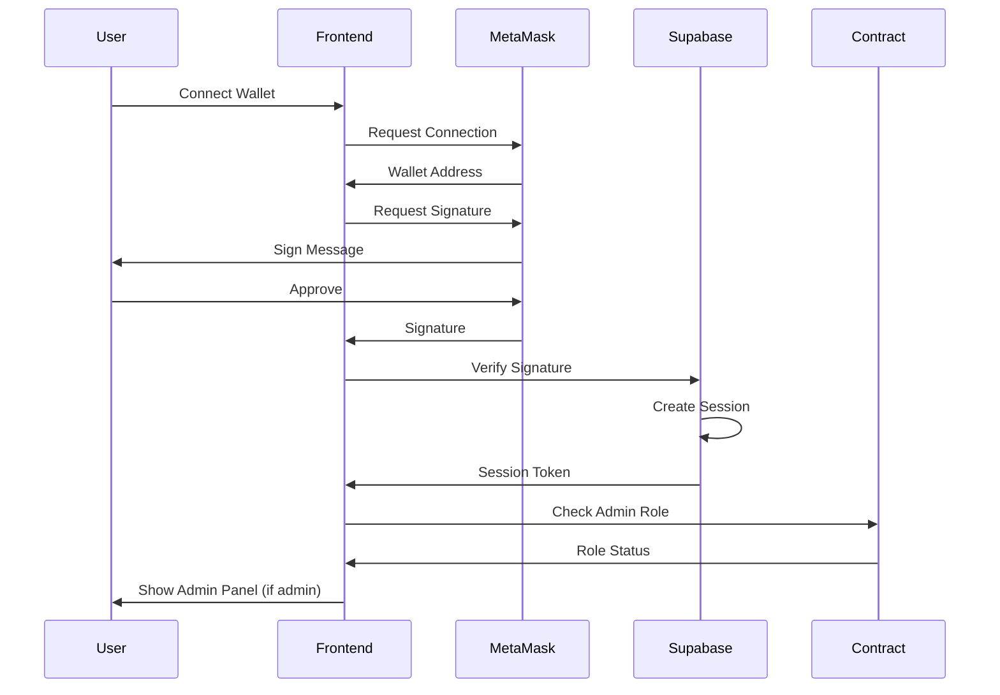
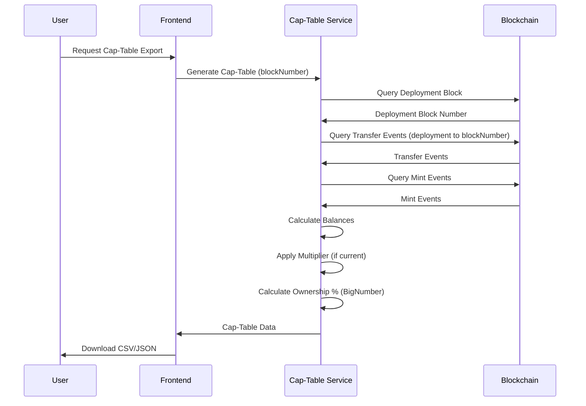
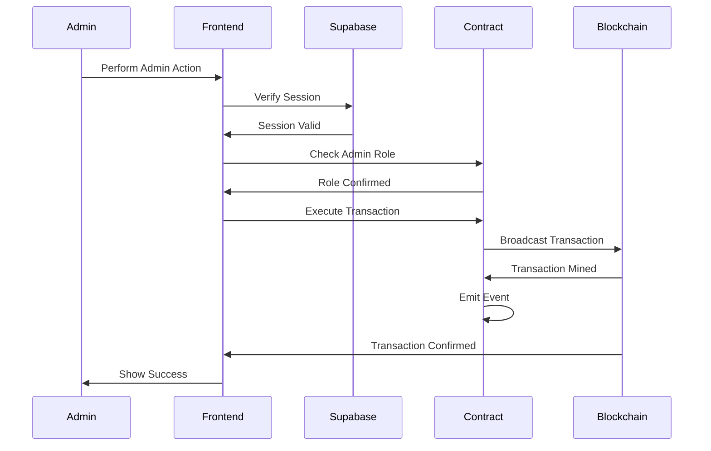

# Core Workflows

### User Authentication Flow

```mermaid
sequenceDiagram
    participant U as User
    participant UI as Frontend
    participant W as MetaMask
    participant S as Supabase
    participant C as Contract
    
    U->>UI: Connect Wallet
    UI->>W: Request Connection
    W->>UI: Wallet Address
    UI->>W: Request Signature
    W->>U: Sign Message
    U->>W: Approve
    W->>UI: Signature
    UI->>S: Verify Signature
    S->>S: Create Session
    S->>UI: Session Token
    UI->>C: Check Admin Role
    C->>UI: Role Status
    UI->>U: Show Admin Panel (if admin)
```

### Cap-Table Generation Flow

```mermaid
sequenceDiagram
    participant U as User
    participant UI as Frontend
    participant CS as Cap-Table Service
    participant BC as Blockchain
    
    U->>UI: Request Cap-Table Export
    UI->>CS: Generate Cap-Table (blockNumber)
    CS->>BC: Query Deployment Block
    BC->>CS: Deployment Block Number
    CS->>BC: Query Transfer Events (deployment to blockNumber)
    BC->>CS: Transfer Events
    CS->>BC: Query Mint Events
    BC->>CS: Mint Events
    CS->>CS: Calculate Balances
    CS->>CS: Apply Multiplier (if current)
    CS->>CS: Calculate Ownership % (BigNumber)
    CS->>UI: Cap-Table Data
    UI->>U: Download CSV/JSON
```

### Admin Operation Flow

```mermaid
sequenceDiagram
    participant A as Admin
    participant UI as Frontend
    participant S as Supabase
    participant C as Contract
    participant BC as Blockchain
    
    A->>UI: Perform Admin Action
    UI->>S: Verify Session
    S->>UI: Session Valid
    UI->>C: Check Admin Role
    C->>UI: Role Confirmed
    UI->>C: Execute Transaction
    C->>BC: Broadcast Transaction
    BC->>C: Transaction Mined
    C->>C: Emit Event
    BC->>UI: Transaction Confirmed
    UI->>A: Show Success
```

---

