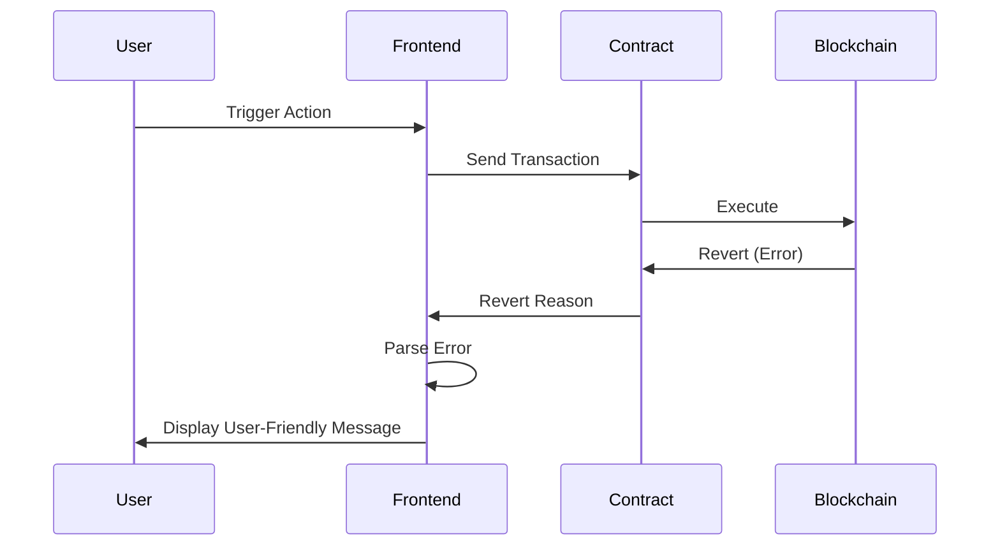

# Error Handling Strategy

### Error Flow



### Error Response Format

```typescript
interface ContractError {
  code: string;
  message: string;
  reason?: string;
  transactionHash?: string;
}

// Example error handling
try {
  await contract.approveWallet(address);
} catch (error) {
  if (error.reason) {
    showError(`Transaction failed: ${error.reason}`);
  } else {
    showError('Transaction failed. Please try again.');
  }
}
```

### Frontend Error Handling

```typescript
// lib/errors.ts
export function handleContractError(error: any): string {
  if (error.reason) {
    return error.reason;
  }
  if (error.message?.includes('user rejected')) {
    return 'Transaction cancelled by user';
  }
  return 'An unexpected error occurred';
}
```

### Backend Error Handling

```typescript
// backend/utils/errors.ts
function handleTransactionError(error: any): { error: string } {
  if (error.reason) {
    return { error: error.reason };
  }
  return { error: 'Transaction failed' };
}
```

---

