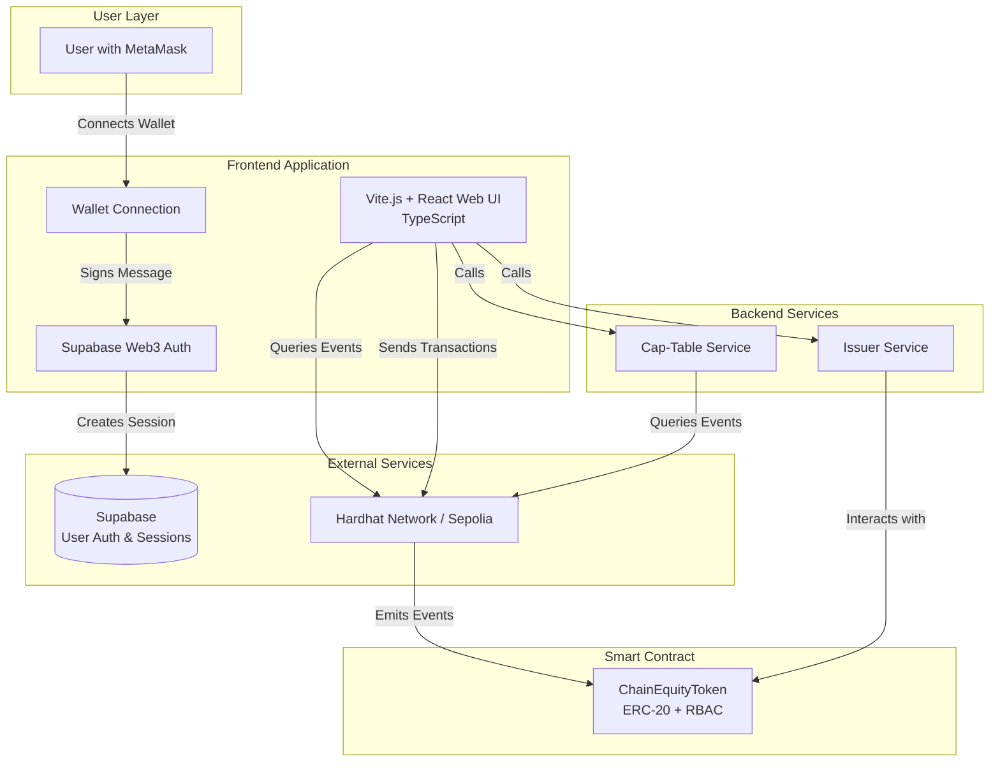

# High Level Architecture

### Technical Summary

ChainEquity is a blockchain-based tokenized equity system built on Ethereum-compatible networks (Hardhat local network for development, Sepolia testnet for public demo). The architecture follows a decentralized approach where the smart contract serves as the source of truth for token ownership, allowlist status, and corporate actions. The frontend application uses Supabase Web3 authentication for user session management, while all cap-table data is generated on-demand by querying blockchain events directly. This design eliminates the need for a separate event indexer while maintaining full historical query capabilities.

The system uses Vite.js + React (TypeScript) for the frontend, ethers.js (TypeScript) for blockchain interactions, and Supabase for Web3 authentication. The smart contract is built with Solidity 0.8.x and OpenZeppelin libraries, implementing ERC-20 standards with custom transfer restrictions and corporate action capabilities. All code is written in TypeScript wherever possible for type safety and better developer experience.

**Precision Handling:** The system uses BigNumber for all balance and percentage calculations to avoid JavaScript number precision loss. Ownership percentages are calculated with high precision and stored as strings with fixed decimal places.

### Platform and Infrastructure Choice

**Selected Platform:** Monorepo + Local Development + Supabase Cloud + Firebase Hosting

**Key Services:**
- **Blockchain:** Hardhat Network (local) / Sepolia Testnet (public demo)
- **Authentication:** Supabase Web3 Auth (cloud-hosted)
- **Frontend Hosting:** Firebase Hosting (global CDN)
- **RPC Provider:** Local Hardhat node / Infura/Alchemy (for Sepolia)

**Deployment Host and Regions:**
- Local development: Hardhat network on localhost:8545
- Supabase: Cloud-hosted (region TBD based on Supabase project location)
- Firebase Hosting: Global CDN for frontend deployment
- Monorepo structure: Single repository with npm workspaces

**Rationale:**
- Hardhat local network provides zero-cost, fast iteration during development
- Supabase Web3 Auth handles authentication complexity without requiring custom backend
- Direct blockchain queries eliminate database dependency for cap-table data
- Monorepo simplifies development and deployment
- Firebase Hosting provides simple, reliable hosting with global CDN
- Simple architecture suitable for 24-hour sprint timeline

### Repository Structure

**Structure:** Monorepo (single repository with npm workspaces)

**Monorepo Tool:** npm workspaces (simple, no additional tooling required)

**Package Organization:**
```
chain-equity/                           # Monorepo root
├── contracts/                         # Hardhat workspace
│   ├── src/
│   │   └── ChainEquityToken.sol       # Main token contract
│   ├── scripts/
│   │   ├── deploy.ts                  # Deployment script (TypeScript)
│   │   └── demo.ts                    # Demo flow script (TypeScript)
│   ├── test/
│   │   └── ChainEquityToken.test.ts   # Contract test suite (TypeScript)
│   └── hardhat.config.ts              # Hardhat configuration (TypeScript)
├── backend/                           # Backend workspace
│   ├── src/
│   │   ├── cap-table.ts               # Cap-table generation (TypeScript)
│   │   └── issuer.ts                  # Issuer service (TypeScript)
│   └── package.json
├── frontend/                          # Frontend workspace (Vite.js)
│   ├── src/
│   │   ├── pages/                     # React pages/components
│   │   ├── components/                # React components (TypeScript)
│   │   ├── lib/                       # Contract interaction utilities (TypeScript)
│   │   └── main.tsx                   # Vite entry point
│   ├── vite.config.ts                 # Vite configuration
│   ├── tsconfig.json                      # TypeScript configuration
│   ├── tailwind.config.js             # Tailwind CSS configuration
│   ├── postcss.config.js              # PostCSS configuration
│   └── package.json
├── package.json                        # Root package.json (workspace config)
├── firebase.json                       # Firebase Hosting configuration
└── README.md
```

**Rationale:**
- **Monorepo:** Single repository simplifies development, deployment, and dependency management
- **npm workspaces:** Sufficient for this project size, no additional tooling required
- **TypeScript throughout:** Type safety across frontend, backend, and contract scripts
- **Clear separation:** Each workspace has distinct purpose while sharing dependencies
- **Vite.js:** Fast development server and optimized production builds
- **Firebase Hosting:** Simple, reliable hosting with global CDN

### High Level Architecture Diagram



### Architectural Patterns

- **Smart Contract as Source of Truth:** All token state, allowlist, and ownership data stored on-chain
- **Event-Driven Cap-Table Generation:** Cap-table calculated by processing Transfer/Mint/Burn events on-demand
- **Web3 Authentication Pattern:** Wallet-based authentication with Supabase session management
- **Component-Based Frontend:** React components with Vite.js for fast development
- **Direct Blockchain Queries:** No intermediate database layer for cap-table data
- **Role-Based Access Control (RBAC):** On-chain role management using OpenZeppelin AccessControl
- **Monorepo Pattern:** Single repository with npm workspaces for code organization

---

