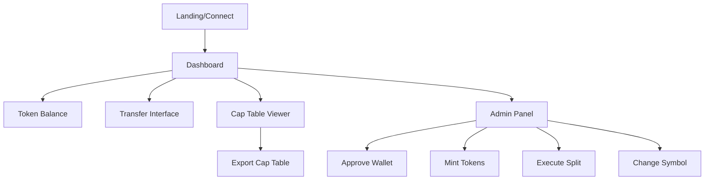
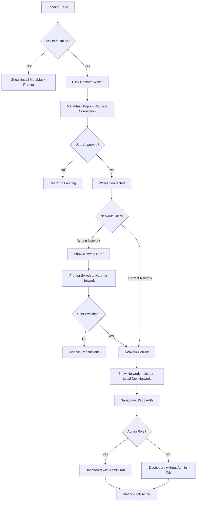
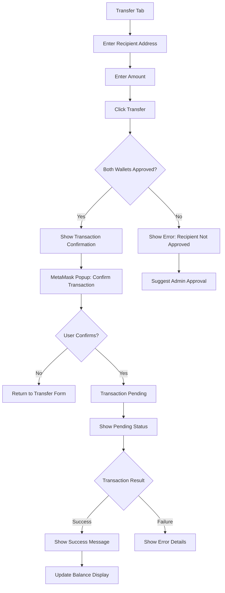
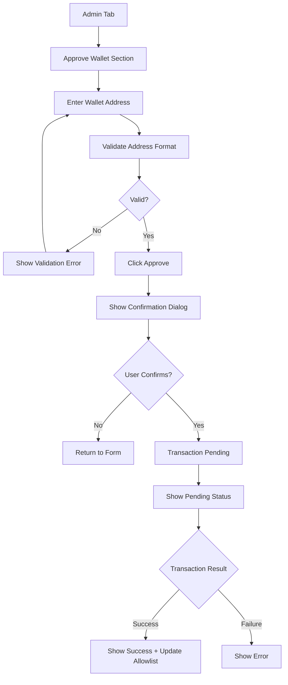
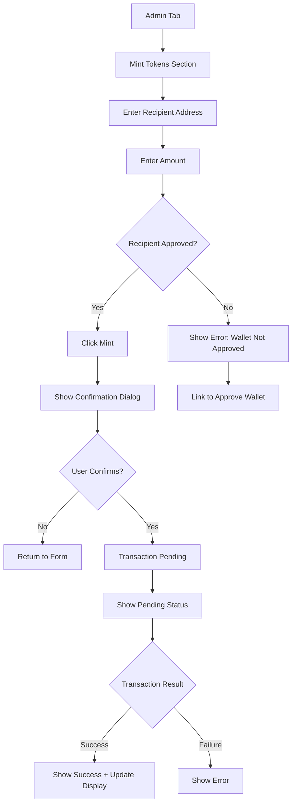
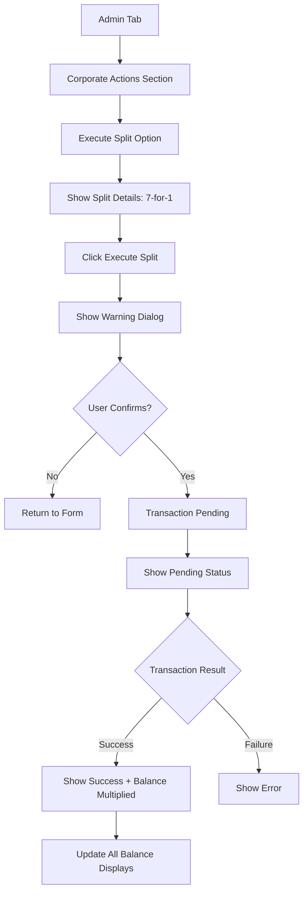
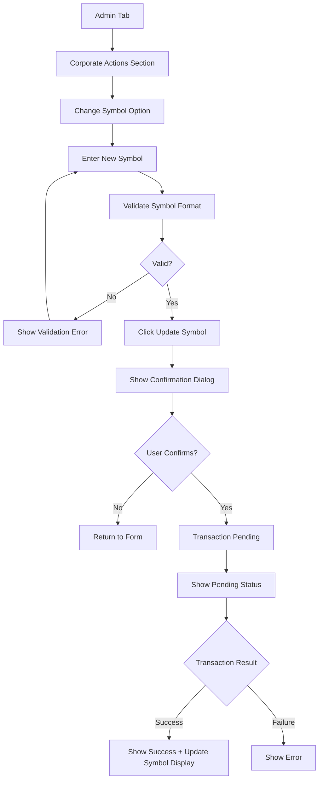
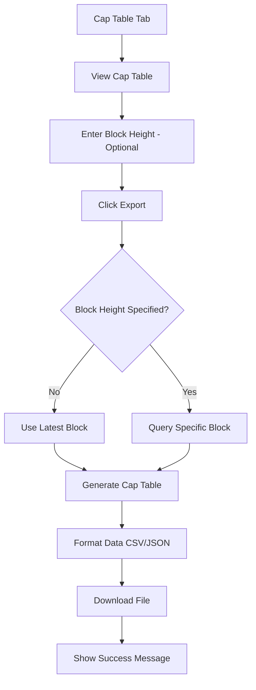

# Chain Equity UI/UX Specification

This document defines the user experience goals, information architecture, user flows, and visual design specifications for Chain Equity's user interface. It serves as the foundation for visual design and frontend development, ensuring a cohesive and user-centered experience.

## Overall UX Goals & Principles

### Target User Personas

**Admin User:**
- Technical professionals managing tokenized equity
- Needs efficient access to allowlist management, token minting, and corporate actions
- Values clarity and speed in administrative tasks
- Requires clear confirmation for destructive actions (splits, symbol changes)

**Token Holder:**
- Users holding tokenized securities
- Needs to view balance, transfer tokens, and understand transaction status
- Values transparency and clear feedback on transfer restrictions
- May be less technical, requiring intuitive wallet connection flow

**Demo Viewer:**
- Stakeholders evaluating the platform
- Needs to understand the full feature set quickly
- Values clear visual feedback for all demo scenarios (success, blocked transfers, corporate actions)

### Usability Goals

- **Ease of learning:** New users can connect wallet and view balance within 2 minutes
- **Efficiency of use:** Admin users can approve wallets and mint tokens with minimal clicks
- **Error prevention:** Clear validation and confirmation dialogs for all blockchain transactions
- **Transparency:** Real-time feedback on transaction status (pending, success, failure)
- **Accessibility:** WCAG 2.1 AA compliance for inclusive access

### Design Principles

1. **Minimalism First** - Remove all non-essential elements; every UI component must serve a clear purpose
2. **Dark Theme Excellence** - Leverage dark backgrounds for reduced eye strain and modern aesthetic
3. **Clarity Over Cleverness** - Prioritize clear communication over aesthetic innovation
4. **Progressive Disclosure** - Show only what's needed, when it's needed (especially for admin functions)
5. **Immediate Feedback** - Every blockchain action should have clear, immediate visual response
6. **Consistent Patterns** - Use familiar Web3 UI patterns (wallet connection, transaction confirmations)

### Change Log

| Date | Version | Description | Author |
|------|---------|-------------|--------|
| 2024-12-XX | 1.0 | Initial specification for Epic 5 | UX Expert |

## Information Architecture (IA)

### Site Map / Screen Inventory

### Navigation Structure

**Primary Navigation:**
- Minimal top navigation bar (dark theme)
- Left side: Logo/Brand name
- Right side: Wallet connection status + Network indicator + Admin toggle (if admin role)
- Network indicator shows "Local Dev Network" when connected (green indicator)
- Network indicator shows warning (red) if wrong network detected
- Single-page application with smooth section scrolling

**Secondary Navigation:**
- Tab-based navigation for main dashboard sections:
  - **Balance** - Token balance overview
  - **Transfer** - Transfer tokens interface
  - **Cap Table** - Cap table viewer with export
  - **Admin** - Admin panel (role-based, hidden for non-admins)
- Tabs styled with dark theme, minimal design
- Active tab clearly indicated with accent color

**Breadcrumb Strategy:**
- Not required for single-page application
- Tab navigation provides clear section context
- Consider subtle progress indicators for multi-step flows (wallet connection, admin actions)

## Network Configuration

### Network Selection

**Current Implementation:** Dev-Net Only (Hardhat Local Network)

For the initial release, the application will only support the local Hardhat development network. Network selection UI will be prepared for future expansion but will be disabled/hidden for now.

**Supported Networks (Future):**
- **Dev-Net:** Hardhat local network (localhost:8545) - **CURRENTLY ACTIVE**
- **Test-Net:** Sepolia testnet (future expansion)
- **Main-Net:** Ethereum mainnet (future expansion - not for production use)

### Network Configuration Details

**Dev-Net (Hardhat Local):**
- **Chain ID:** 31337 (Hardhat default)
- **RPC URL:** http://localhost:8545
- **Block Explorer:** None (local network)
- **Status:** Active and required for all operations
- **UI Display:** Show "Local Dev Network" or "Hardhat Network" indicator

**Network Selection UI (Prepared for Future):**
- Network selector dropdown in top navigation (currently hidden/disabled)
- Visual indicator showing current network
- Network switching flow (prepared but not active)
- Warning indicators for wrong network

**Current Behavior:**
- Application automatically connects to Hardhat local network
- No network selection UI visible to users
- Network indicator shows "Dev Network" or "Local Network"
- If wallet is on wrong network, prompt to switch to Hardhat network (Chain ID 31337)
- All transaction confirmations reference local network

**Future Expansion Considerations:**
- Network selector will be added to top navigation when testnet support is added
- Network switching will require wallet approval
- Different block explorers per network (Etherscan for testnet/mainnet)
- Network-specific contract addresses will be managed via environment variables

### Network Validation

**Before Transactions:**
- Validate wallet is connected to correct network (Chain ID 31337)
- If wrong network detected, show clear error message with instructions to switch
- Provide "Switch Network" button that triggers MetaMask network switch request
- Disable transaction buttons until correct network is connected

**Network Status Indicator:**
- Display in top navigation bar (next to wallet connection status)
- Show network name: "Local Dev Network"
- Color coding: Green for correct network, Red for wrong network
- Tooltip on hover showing Chain ID and RPC URL

## User Flows

### Wallet Connection & Authentication

**User Goal:** Connect MetaMask wallet and authenticate with Supabase

**Entry Points:** Landing page, "Connect Wallet" button in navigation

**Success Criteria:** Wallet connected, user authenticated, dashboard accessible

#### Flow Diagram

#### Edge Cases & Error Handling:
- MetaMask not installed: Show clear instructions with link to install
- User rejects connection: Return to landing with no error (user choice)
- Wrong network: Detect and prompt to switch to Hardhat network (Chain ID 31337)
  - Show clear error message: "Please switch to Local Dev Network"
  - Provide "Switch Network" button that triggers MetaMask network switch
  - Disable all transaction buttons until correct network is connected
- Wallet locked: Show message to unlock wallet in MetaMask
- Authentication failure: Show error message with retry option
- Network switch rejected: Show message that transactions are disabled until network is correct

**Notes:** This is the critical first impression flow. Keep it simple and clear. Use familiar Web3 patterns.

### Transfer Tokens

**User Goal:** Transfer tokens to another wallet address

**Entry Points:** Transfer tab in dashboard

**Success Criteria:** Transfer succeeds if both wallets approved, or clear error if recipient not approved

#### Flow Diagram

#### Edge Cases & Error Handling:
- Recipient not on allowlist: Clear error message explaining restriction
- Sender not on allowlist: Should not happen if UI checks, but show error if detected
- Insufficient balance: Validate before transaction, show clear error
- Invalid address format: Real-time validation with clear feedback
- Transaction rejection: User-friendly message, no technical jargon
- Transaction failure: Show error reason (gas, network, etc.)
- Network issues: Detect and show connection error

**Notes:** This flow demonstrates the core compliance gating feature. The error state for non-approved recipients is a key demo scenario.

### Admin: Approve Wallet

**User Goal:** Add a wallet address to the allowlist

**Entry Points:** Admin tab → Approve Wallet section

**Success Criteria:** Wallet added to allowlist, confirmation shown

#### Flow Diagram

#### Edge Cases & Error Handling:
- Invalid address format: Real-time validation
- Address already approved: Check and show status, disable button
- Transaction failure: Show error with retry option
- Network issues: Detect and show connection error

**Notes:** This is a critical admin function. Clear confirmation prevents accidental approvals.

### Admin: Mint Tokens

**User Goal:** Mint tokens to an approved wallet

**Entry Points:** Admin tab → Mint Tokens section

**Success Criteria:** Tokens minted to specified wallet, balance updated

#### Flow Diagram

#### Edge Cases & Error Handling:
- Recipient not approved: Clear error with link to approve wallet
- Invalid amount: Validate (positive number, within limits)
- Invalid address: Real-time validation
- Transaction failure: Show error with retry option

**Notes:** Validate recipient approval before allowing mint action.

### Admin: Execute Split

**User Goal:** Execute a 7-for-1 stock split

**Entry Points:** Admin tab → Corporate Actions → Execute Split

**Success Criteria:** All balances multiplied by 7, confirmation shown

#### Flow Diagram

#### Edge Cases & Error Handling:
- Transaction failure: Show error with retry option
- Network issues: Detect and show connection error
- Confirmation required: Strong warning dialog (destructive action)

**Notes:** This is a destructive action. Use a prominent warning dialog. Show clear before/after balance comparison.

### Admin: Change Symbol

**User Goal:** Update the token ticker symbol

**Entry Points:** Admin tab → Corporate Actions → Change Symbol

**Success Criteria:** Symbol updated, displayed throughout UI

#### Flow Diagram

#### Edge Cases & Error Handling:
- Invalid symbol format: Real-time validation (length, characters)
- Transaction failure: Show error with retry option
- Symbol unchanged: Check and show message if same symbol

**Notes:** Less critical than split, but still requires confirmation. Update symbol display immediately after success.

### Export Cap Table

**User Goal:** Export cap table at a specific block height

**Entry Points:** Cap Table tab → Export button

**Success Criteria:** Cap table data exported (CSV/JSON), download initiated

#### Flow Diagram

#### Edge Cases & Error Handling:
- Invalid block height: Validate format and range
- Block not found: Show error if block doesn't exist
- Large dataset: Show loading state, consider pagination
- Export failure: Show error with retry option

**Notes:** Cap table generation may take time. Show loading state. Allow export at current block or historical block.

## Wireframes & Mockups

**Primary Design Files:** _To be created in Figma/Sketch - Link to be added_

### Key Screen Layouts

#### Landing / Wallet Connection

**Purpose:** First impression, wallet connection interface

**Key Elements:**
- Centered connection card on dark background
- "Connect Wallet" primary button
- Minimal branding/logo
- MetaMask icon/instructions if wallet not detected
- Network validation message (if wrong network detected)
- Network indicator (if connected - shows "Local Dev Network")

**Interaction Notes:** 
- Single clear call-to-action: Connect Wallet
- If wallet not installed, show install instructions
- After connection, validate network (must be Hardhat local - Chain ID 31337)
- If wrong network, show error message with "Switch Network" button
- After network validation, smoothly transition to dashboard
- Use subtle animations for state changes
- Network indicator always visible once connected

**Design File Reference:** _Landing frame to be created_

#### Dashboard - Balance Tab

**Purpose:** Display token balance and basic account information

**Key Elements:**
- Top navigation bar (minimal, dark)
- Tab navigation (Balance, Transfer, Cap Table, Admin)
- Large balance display (token amount + symbol)
- Wallet address (truncated, copy button)
- Network status indicator ("Local Dev Network" with green indicator)
- Recent activity list (optional, minimal)

**Interaction Notes:**
- Balance prominently displayed
- Copy wallet address on click
- Tab switching is instant (no page reload)
- Dark theme with subtle accent color for active tab
- Network indicator always visible when wallet connected
- Network indicator shows green for correct network (Hardhat local)

**Design File Reference:** _Balance tab frame to be created_

#### Dashboard - Transfer Tab

**Purpose:** Transfer tokens between approved wallets

**Key Elements:**
- Transfer form (recipient address, amount)
- Balance display (available balance)
- "Transfer" button
- Transaction status area (pending, success, error)
- Validation feedback (real-time)

**Interaction Notes:**
- Real-time address validation
- Amount validation (max balance, positive number)
- Clear error states for non-approved recipients
- Transaction confirmation flow (MetaMask popup)
- Success/error feedback with clear messaging

**Design File Reference:** _Transfer tab frame to be created_

#### Dashboard - Cap Table Tab

**Purpose:** View and export cap table data

**Key Elements:**
- Cap table table/list (wallet addresses, balances, percentages)
- Block height input (optional, for historical queries)
- Export button (CSV/JSON format selector)
- Loading state for data generation
- Pagination (if large dataset)

**Interaction Notes:**
- Default to latest block, allow historical queries
- Export triggers download
- Show loading state during cap table generation
- Table should be scannable (dark theme, clear rows)

**Design File Reference:** _Cap Table tab frame to be created_

#### Dashboard - Admin Tab

**Purpose:** Administrative functions (role-based access)

**Key Elements:**
- Section: Approve Wallet (address input, approve button)
- Section: Mint Tokens (recipient, amount, mint button)
- Section: Corporate Actions
  - Execute Split (7-for-1, warning dialog)
  - Change Symbol (symbol input, update button)
- Confirmation dialogs for all actions
- Transaction status indicators

**Interaction Notes:**
- Progressive disclosure: sections can be collapsed
- All actions require confirmation dialogs
- Strong warning for destructive actions (split)
- Real-time validation for all inputs
- Clear success/error feedback

**Design File Reference:** _Admin tab frame to be created_

#### Transaction Confirmation Dialog

**Purpose:** Confirm blockchain transactions before submission

**Key Elements:**
- Transaction details (action, recipient, amount)
- Gas estimate (optional, for transparency)
- "Confirm" and "Cancel" buttons
- Network indicator

**Interaction Notes:**
- Modal overlay (dark background, centered)
- Clear transaction summary
- Cancel returns to form without error
- Confirm triggers MetaMask popup

**Design File Reference:** _Confirmation dialog frame to be created_

#### Transaction Status States

**Purpose:** Show real-time transaction feedback

**Key Elements:**
- Pending: Spinner + "Transaction pending..." message
- Success: Checkmark + success message + transaction hash link
- Error: Error icon + error message + retry option

**Interaction Notes:**
- Non-intrusive notification (toast or inline)
- Auto-dismiss success after 5 seconds
- Error persists until user dismisses
- Transaction hash links to block explorer

**Design File Reference:** _Status states frame to be created_

## Component Library / Design System

**Design System Approach:** Custom minimal design system built with Tailwind CSS. Focus on dark theme, clean typography, and essential components. No heavy UI library dependencies - keep it lightweight and minimal.

### Core Components

#### Button

**Purpose:** Primary action trigger for all user interactions

**Variants:**
- Primary: Main actions (Connect Wallet, Transfer, Confirm)
- Secondary: Less critical actions (Cancel, Export)
- Destructive: Dangerous actions (Execute Split) - red/warning color
- Disabled: Inactive state (grayed out, no interaction)

**States:**
- Default: Normal state
- Hover: Subtle highlight
- Active: Pressed state
- Disabled: Non-interactive
- Loading: Spinner + disabled state

**Usage Guidelines:**
- Use primary for main actions (one per screen)
- Use secondary for cancel/back actions
- Use destructive for irreversible actions
- Show loading state during blockchain transactions
- Disable buttons during pending transactions

#### Input Field

**Purpose:** Text input for addresses, amounts, symbols

**Variants:**
- Standard: Single-line text input
- Number: Amount input with validation
- Address: Wallet address with validation indicator

**States:**
- Default: Empty state
- Focus: Active input state
- Valid: Valid input indicator (green checkmark)
- Invalid: Error state (red border + error message)
- Disabled: Non-editable state

**Usage Guidelines:**
- Real-time validation for addresses
- Clear error messages below invalid inputs
- Show validation state visually (checkmark/X icon)
- Use placeholder text for guidance
- Format addresses (truncate with ellipsis, show full on hover)

#### Tab Navigation

**Purpose:** Switch between dashboard sections

**Variants:**
- Horizontal tabs: Main navigation
- Active tab: Highlighted with accent color
- Inactive tabs: Subtle, dark background

**States:**
- Default: Inactive tab
- Active: Current tab (accent color, underline or background)
- Hover: Subtle highlight on hover

**Usage Guidelines:**
- Use for main dashboard sections (Balance, Transfer, Cap Table, Admin)
- Active tab clearly indicated
- Smooth transition between tabs
- Hide Admin tab for non-admin users

#### Modal / Dialog

**Purpose:** Confirm actions, show important information

**Variants:**
- Confirmation: Transaction confirmation dialogs
- Warning: Destructive action warnings (split)
- Information: Status messages, errors

**States:**
- Open: Visible with overlay
- Closing: Fade out animation

**Usage Guidelines:**
- Use for all blockchain transaction confirmations
- Strong warning for destructive actions
- Clear "Confirm" and "Cancel" buttons
- Close on overlay click (for non-critical dialogs)
- Prevent closing during pending transactions

#### Status Indicator

**Purpose:** Show transaction and system status

**Variants:**
- Pending: Spinner + message
- Success: Checkmark + success message
- Error: Error icon + error message
- Info: Information icon + message

**States:**
- Inline: Within form/component
- Toast: Floating notification
- Banner: Top of screen notification

**Usage Guidelines:**
- Use inline for form validation
- Use toast for transaction feedback
- Auto-dismiss success messages (5 seconds)
- Persist error messages until user dismisses
- Include action links (transaction hash, retry button)

#### Table

**Purpose:** Display cap table data

**Variants:**
- Standard: Data table with rows/columns
- Sortable: Columns with sort functionality (optional)

**States:**
- Loading: Skeleton or spinner
- Empty: No data message
- Populated: Data rows

**Usage Guidelines:**
- Dark theme with subtle row separators
- Clear column headers
- Truncate long addresses with copy button
- Show percentages with appropriate precision
- Pagination for large datasets

#### Card / Container

**Purpose:** Group related content

**Variants:**
- Standard: Content container
- Elevated: Prominent content (balance display)
- Collapsible: Admin sections

**States:**
- Default: Normal state
- Expanded: Open collapsible
- Collapsed: Closed collapsible

**Usage Guidelines:**
- Use for grouping related form fields
- Use elevated card for prominent balance display
- Use collapsible for admin sections (progressive disclosure)
- Consistent padding and spacing

#### Wallet Connection Badge

**Purpose:** Show wallet connection status in navigation

**Variants:**
- Disconnected: "Connect Wallet" button
- Connected: Wallet address (truncated) + disconnect option
- Network: Network indicator (always shown when connected)

**States:**
- Disconnected: Show connect button
- Connected: Show address + network indicator
- Wrong Network: Warning indicator (red) + switch network prompt
- Correct Network: Success indicator (green) + "Local Dev Network" label

**Usage Guidelines:**
- Always visible in top navigation
- Truncate address (first 4 + last 4 characters)
- Show full address on hover/click
- Include copy address functionality
- Network indicator always shown when wallet is connected
- Network indicator shows "Local Dev Network" for Hardhat (Chain ID 31337)
- Color coding: Green for correct network, Red for wrong network
- Tooltip on network indicator shows Chain ID and RPC URL
- If wrong network, show "Switch Network" button next to indicator

## Branding & Style Guide

### Visual Identity

**Brand Guidelines:** _To be defined - Minimal, professional, blockchain-focused_

### Color Palette

| Color Type | Hex Code | Usage |
|------------|----------|-------|
| Primary | `#3B82F6` (Blue-500) | Primary buttons, active states, links |
| Secondary | `#6B7280` (Gray-500) | Secondary actions, inactive elements |
| Accent | `#10B981` (Green-500) | Success states, valid indicators |
| Success | `#10B981` (Green-500) | Success messages, confirmations |
| Warning | `#F59E0B` (Amber-500) | Warnings, caution states |
| Error | `#EF4444` (Red-500) | Error messages, destructive actions |
| Background | `#0F172A` (Slate-900) | Main background |
| Surface | `#1E293B` (Slate-800) | Cards, containers, elevated surfaces |
| Border | `#334155` (Slate-700) | Borders, dividers |
| Text Primary | `#F1F5F9` (Slate-100) | Primary text, headings |
| Text Secondary | `#CBD5E1` (Slate-300) | Secondary text, labels |
| Text Muted | `#94A3B8` (Slate-400) | Muted text, placeholders |

### Typography

#### Font Families

- **Primary:** Inter or System UI (sans-serif) - Clean, modern, readable
- **Secondary:** Same as primary (no secondary font needed for minimal design)
- **Monospace:** 'JetBrains Mono' or 'Fira Code' - For addresses, transaction hashes

#### Type Scale

| Element | Size | Weight | Line Height |
|---------|------|--------|-------------|
| H1 | 2.25rem (36px) | 700 | 1.2 |
| H2 | 1.875rem (30px) | 600 | 1.3 |
| H3 | 1.5rem (24px) | 600 | 1.4 |
| Body | 1rem (16px) | 400 | 1.5 |
| Small | 0.875rem (14px) | 400 | 1.5 |
| Caption | 0.75rem (12px) | 400 | 1.4 |

### Iconography

**Icon Library:** Heroicons or Lucide Icons (minimal, consistent line style)

**Usage Guidelines:**
- Use icons sparingly - only when they add clarity
- Consistent stroke width (1.5-2px)
- Match icon size to text size
- Use icons for actions (copy, export, confirm)
- Use icons for status (success, error, pending)

### Spacing & Layout

**Grid System:**
- No strict grid system - use Tailwind spacing scale
- Container max-width: 1280px (xl breakpoint)
- Consistent padding: 1rem (16px) base, 1.5rem (24px) for cards

**Spacing Scale:**
- Base unit: 0.25rem (4px)
- Common spacing: 0.5rem (8px), 1rem (16px), 1.5rem (24px), 2rem (32px)
- Section spacing: 2rem (32px) between major sections
- Card padding: 1.5rem (24px) internal padding

## Accessibility Requirements

### Compliance Target

**Standard:** WCAG 2.1 Level AA compliance

### Key Requirements

**Visual:**
- Color contrast ratios: Minimum 4.5:1 for normal text, 3:1 for large text (18px+)
- Focus indicators: Clear, visible focus rings on all interactive elements (2px solid primary color)
- Text sizing: Minimum 16px body text, support browser zoom up to 200%

**Interaction:**
- Keyboard navigation: All interactive elements accessible via keyboard (Tab, Enter, Space, Arrow keys)
- Screen reader support: Semantic HTML, ARIA labels for complex components, descriptive alt text
- Touch targets: Minimum 44x44px for all interactive elements

**Content:**
- Alternative text: Descriptive alt text for all icons and images
- Heading structure: Logical heading hierarchy (H1 → H2 → H3)
- Form labels: All inputs have associated labels, error messages linked to inputs

### Testing Strategy

- Automated testing: Use axe DevTools or Lighthouse for initial checks
- Manual testing: Keyboard navigation, screen reader (NVDA/JAWS), color contrast checker
- User testing: Test with users who rely on assistive technologies

## Responsiveness Strategy

### Breakpoints

| Breakpoint | Min Width | Max Width | Target Devices |
|------------|-----------|-----------|----------------|
| Mobile | 0px | 640px | Smartphones |
| Tablet | 641px | 1024px | Tablets |
| Desktop | 1025px | - | Desktop, Laptop |
| Wide | 1440px | - | Large monitors |

### Adaptation Patterns

**Layout Changes:**
- Mobile: Single column, stacked tabs (or hamburger menu), full-width cards
- Tablet: Two-column layout where appropriate, horizontal tabs
- Desktop: Multi-column layouts, horizontal tabs, optimal spacing

**Navigation Changes:**
- Mobile: Hamburger menu or bottom navigation (if needed)
- Tablet/Desktop: Horizontal tab navigation in header

**Content Priority:**
- Mobile: Show essential information first, collapse secondary content
- Desktop: Show all content, use progressive disclosure for admin sections

**Interaction Changes:**
- Mobile: Larger touch targets, swipe gestures for tables (if applicable)
- Desktop: Hover states, keyboard shortcuts

## Animation & Micro-interactions

### Motion Principles

- **Purposeful Motion:** Animations should serve a purpose (feedback, transitions, state changes)
- **Subtle & Fast:** Keep animations under 300ms for most interactions
- **Respect Preferences:** Honor `prefers-reduced-motion` media query
- **Performance First:** Use CSS transforms and opacity for smooth animations

### Key Animations

- **Tab Switch:** Fade transition (200ms) between tab content
- **Button Hover:** Subtle scale (1.02) or color shift (200ms)
- **Modal Open/Close:** Fade + scale animation (250ms)
- **Transaction Status:** Slide-in toast notification (300ms)
- **Form Validation:** Subtle shake for errors (150ms)
- **Loading Spinner:** Smooth rotation animation
- **Page Transitions:** Fade between states (200ms)

## Performance Considerations

### Performance Goals

- **Page Load:** Initial load under 2 seconds
- **Interaction Response:** All interactions respond within 100ms
- **Animation FPS:** Maintain 60fps for all animations

### Design Strategies

- **Lazy Loading:** Load cap table data on demand
- **Optimistic Updates:** Show pending state immediately, update on confirmation
- **Minimal Assets:** Use SVG icons, optimize images
- **Code Splitting:** Split admin panel code (only load for admin users)
- **Caching:** Cache blockchain data where appropriate

## Next Steps

### Immediate Actions

1. Review this specification with stakeholders
2. Create visual designs in Figma/Sketch based on wireframes
3. Set up Tailwind CSS configuration with dark theme colors
4. Begin component development with design system
5. Implement wallet connection flow first (critical path)

### Design Handoff Checklist

- [x] All user flows documented
- [x] Component inventory complete
- [x] Accessibility requirements defined
- [x] Responsive strategy clear
- [x] Brand guidelines incorporated (dark theme)
- [x] Performance goals established

### Checklist Results

_To be completed after design review_

